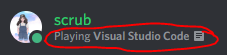

# Configuring the bot
--- 

## Bot token
Follow the Troubleshooting guide to find / add the bot token. [Here](./troubleshooting.md/).
Open config.json and add the token to the config.token field.

## Prefix
You can change the bot prefix, just make sure it has no whitespaces
To do this, change the config.prefix field in config.json

## Database
The Database is dynamically generated on running the bot for the first time.
You can change the names of the tables if you want but I would advise against it as their is no need unless you want access to them with another piece of software.
### Database Name
In config.json you can change the name of the database that is generated / read from. This can be beneficial if someone shares you a database with words / bypasses / permissions already set up.

Warning: Changing this after running the bot for the first time will mean another database file is generated with no values inside of it.

### Table: blacklistedWordsTbl
The name of the table that is created in the database for storing blacklisted words and their associated values.
#### Fields:
```
word : String (PK)
blacklistType : String value:{"DEFAULT" | "DISCRIMINATION" | "SEXUALCONTENT" | "HOSTILILITY" | "PROFANITY"}
severityLevel : Integer value:{1,2,3}
```

### Table: bypassTbl
The name of the table that is created to handle bypasses,
This list only stores ID's and what the Type of ID is.
When a user sends a message, an array of all the ID's associated with them is sent to a function to check if any match this table, if so, the message is not blocked by the bot at all.
#### Fields
```
id: String {Length: 18} (PK)
bypassType: String value {"USER" | "CHANNEL" | "ROLE"}
```

### Table: permissionTbl
Stores a users ID along with their permission level
If a user is attempting to use one of the bots CRUD commands, it will check their access level in this table agaist the permission level to use the command.
#### Fields
```
id: String {Length: 18} (PK)
permissionLevel = Integer value:{1,2,3}
```

## Flags
Flags are hard-coded values that allow the user running the bot on a machine to change the bahaviour of the bot.
### Flag: activites
Allows the Bot to display an Activity every 5 minutes (picked at random from array).


### Flag: responses
When the bot detects a word on the blacklist, it will delete the message sent by the user. If this flag is set, it will also respond with a message picked at random in an array found [Here](../util/responses.json).
