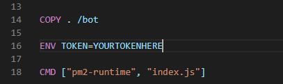

# Troubleshooting
---
## Trouble installing better-sqlite3
Follow [this](https://github.com/JoshuaWise/better-sqlite3/blob/master/docs/troubleshooting.md) guide if you can.
If you have trouble installing `better-sqlite3`, follow this checklist:

1. Make sure you're using nodejs v10.20.1 or later

2. Make sure you have [`node-gyp`](https://github.com/nodejs/node-gyp#installation) globally installed, including all of [its dependencies](https://github.com/nodejs/node-gyp#on-unix). On Windows you may need to [configure some things manually](https://github.com/nodejs/node-gyp#on-windows).

3. If you're using [Electron](https://github.com/electron/electron), try running [`electron-rebuild`](https://www.npmjs.com/package/electron-rebuild)

4. If you're using Windows, follow these steps. Do them **in this order**, and **don't skip steps**.

    1. Install the **latest** of node 10 or node 12.
    2. Start an Admin PowerShell: Right-click the start icon, then pick `Windows PowerShell (Admin)`
    3. Install *both* vs2015 and vs2017 libraries. Each line will take ~5-10 minutes.
       ```sh
       npm install --global --production --vs2015 --add-python-to-path windows-build-tools
       npm install --global --production --add-python-to-path windows-build-tools node-gyp
       ```
    4. In your project, make sure you're not fighting with old build configurations. Delete **both**
       * your `%USERPROFILE%/.node-gyp` and
       * your project's `node_modules` directories.
    5. Set up `%USERPROFILE%/.npmrc` correctly:
       ```sh
       msvs_version=2015
       python=python2.7
       ```
       (where `%USERPROFILE%` is your home directory).
    6. Run `npm install`

If none of these solved your problem, try browsing [previous better-sqlite3 issues](https://github.com/JoshuaWise/better-sqlite3/issues?q=is%3Aissue) or open a [new better-sqlite3 issue](https://github.com/JoshuaWise/better-sqlite3/issues/new).

## Error [TOKEN_INVALID]: An invalid token was provided.
Make sure to enter a valid token. you can do it a few ways.
#### Finding your bots token:
1. To find your bots token, you can find it [here](https://discord.com/developers/applications)
    1. Find the bot account you want to run the application on, click on it
    1. On the left navigation bar, locate and click on bot.
    1. If the Discord application is not currently a bot, click `Add Bot`
    1. If it is a Bot Application, upder Token next to the bots username, click copy.
#### Adding the token to the application Method 1:
1. Go to [./util/config.json](../util/config.json)
1. In the `""` add your bot token and save, run the application again.


#### Adding the token to the application Method 2:
1. Create a file called `.env`
1. Add to the file `TOKEN=YOURTOKENHERE` replacing `YOURTOKENHERE` with the token of your discord bot applicaton.
1. Save the file and run the application again.

#### Experiencing this error with Docker
With docker, you should be able to use [method 1](#Adding-the-token-to-the-application-Method-1:) listed above.

Alternitively, open the [Dockerfile](../Dockerfile) find `ENV TOKEN=YOURTOKENHERE` and replace `YOURTOKENHERE` with your bots token.




